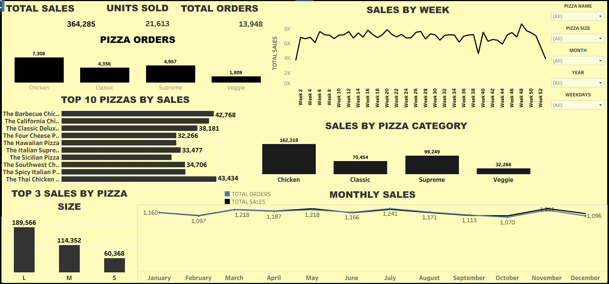

# 🍕 Pizza Sales Analysis Dashboard (Tableau)

## 📷 Dashboard Preview

## 📊 Project Overview

This project presents an interactive Tableau dashboard that analyzes pizza sales performance using various business metrics.
The dashboard helps understand sales trends, product performance, and customer purchasing behavior through visual insights.

The goal of this project is to demonstrate data visualization and analytical skills using Tableau.

## 🎯 Objectives

Analyze overall pizza sales performance

Identify top-performing pizzas

Understand sales trends over time

Compare sales by pizza category and size

Provide interactive filters for better analysis

## 📈 Key Metrics

Total Sales: 364,285

Units Sold: 21,613

Total Orders: 13,948

## 📊 Dashboard Features

## The dashboard includes the following visualizations:

KPI Cards

Total Sales

Units Sold

Total Orders

Sales by Week

Shows weekly sales trends throughout the year.

Pizza Orders by Category

Compares orders across pizza categories such as Chicken, Classic, Supreme, and Veggie.

Top 10 Pizzas by Sales

Identifies the highest-performing pizza products.

Sales by Pizza Category

Shows total sales contribution of each category.

Top Sales by Pizza Size

Analyzes sales distribution across sizes (Small, Medium, Large).

Monthly Sales Trend

Displays month-wise sales patterns.

## 🎛 Filters Used

## The dashboard includes interactive filters to explore the data:

Pizza Name

Pizza Size

Month

Year

Weekdays

## These filters allow users to dynamically analyze sales based on different conditions.

## 🛠 Tools & Technologies

Tableau – Data Visualization

Excel / CSV Dataset – Data Source

Large size pizzas generate the highest revenue.

Chicken category pizzas contribute the highest total sales.

Certain pizzas consistently appear in the top 10 best sellers.

Weekly sales trends show fluctuations across the year.

Sales vary across months indicating seasonal demand patterns.
